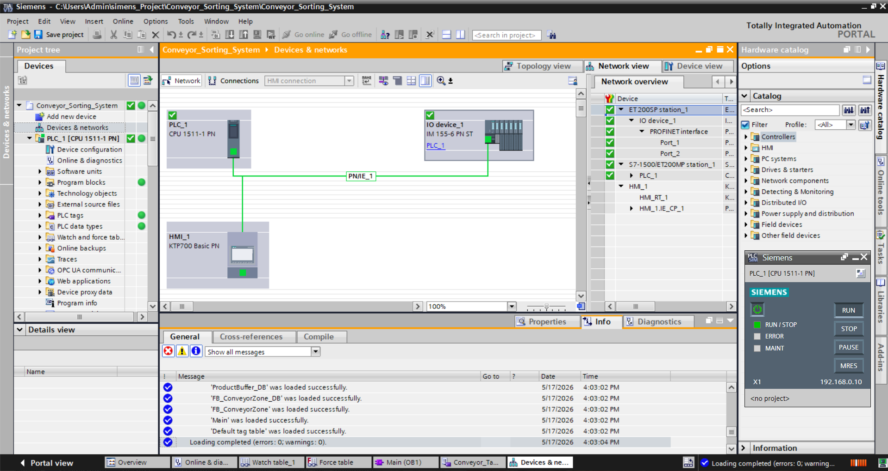
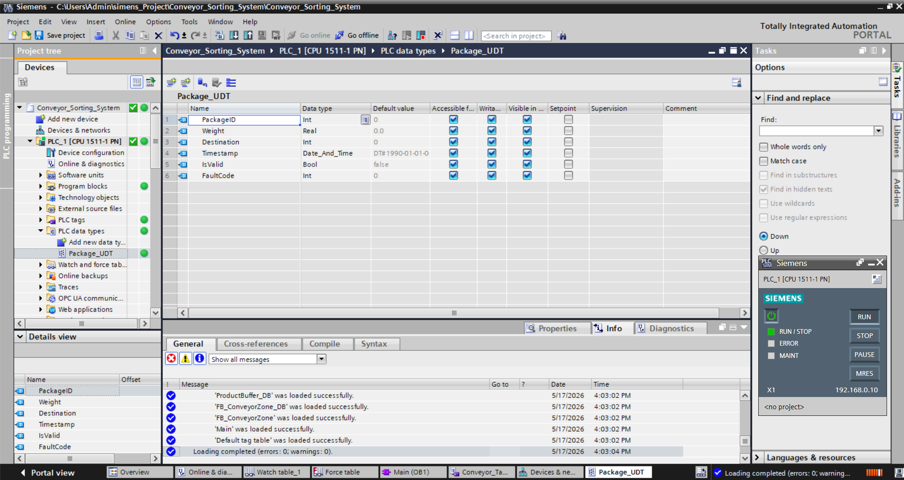
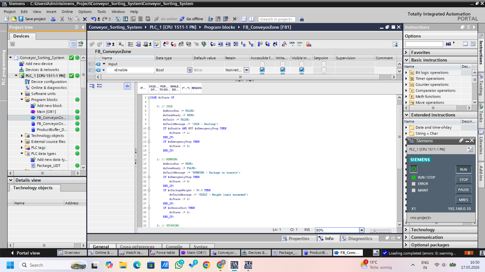
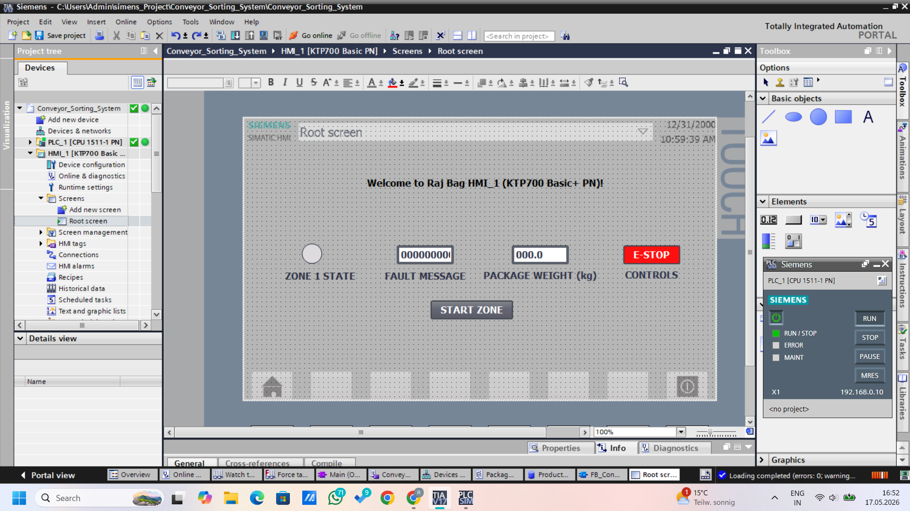
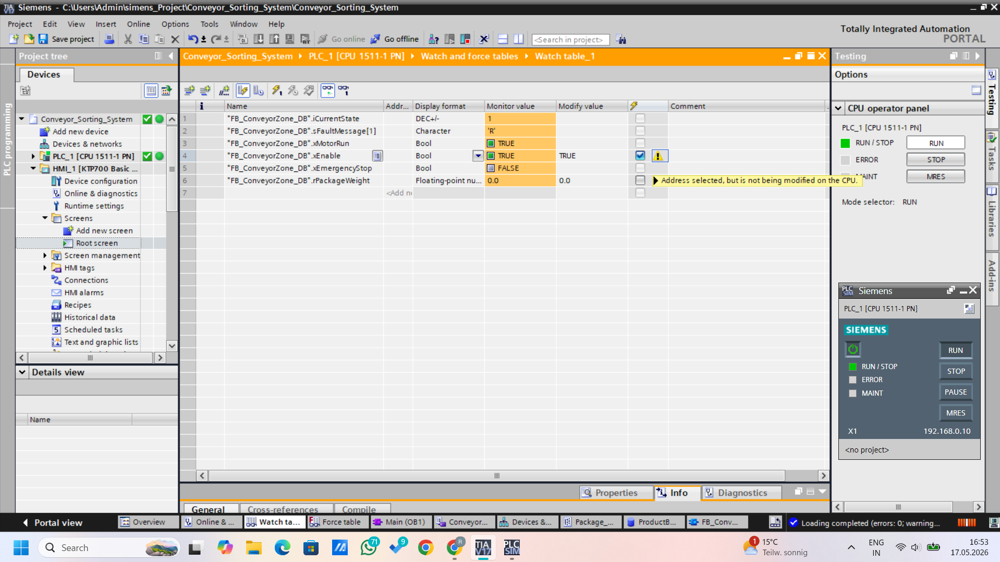
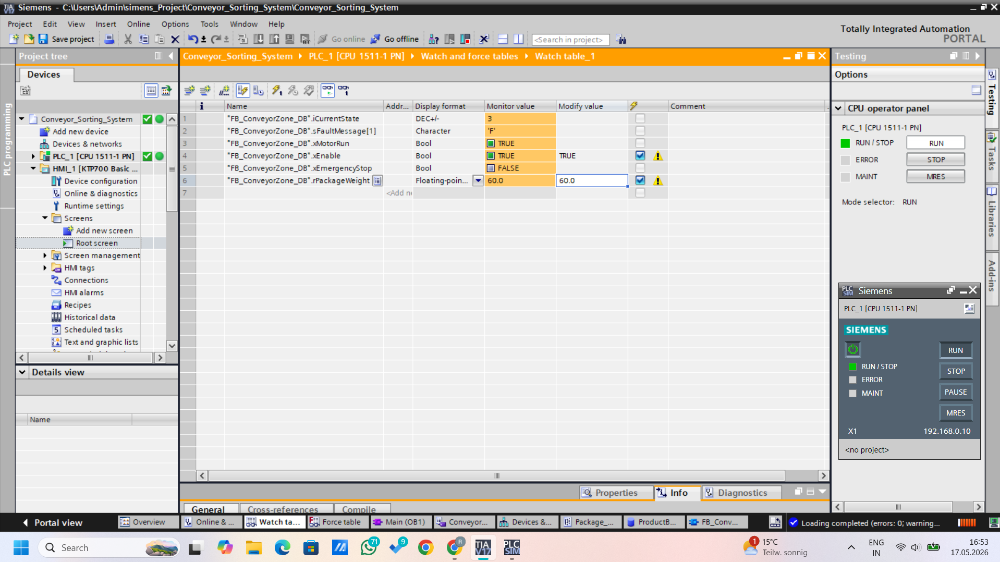
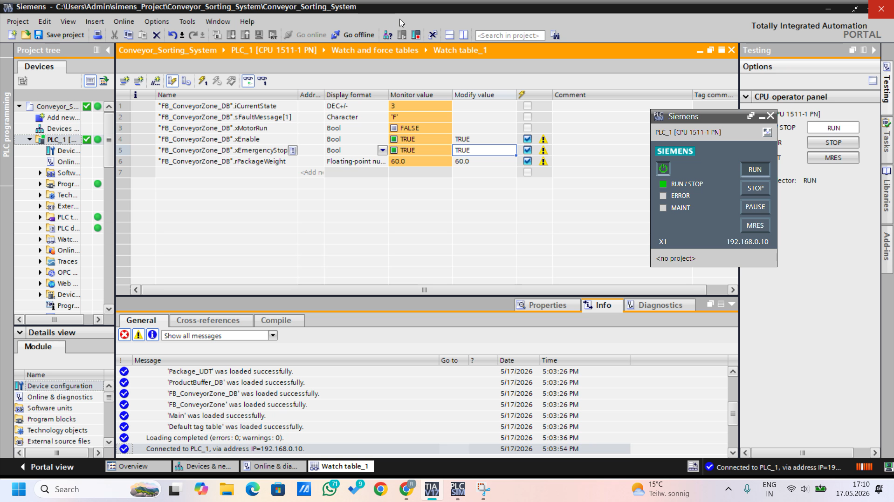

# Siemens S7-1500 SCL Conveyor Sorting System


## Overview
A modular intralogistics conveyor sorting system programmed on a
Siemens S7-1511-1 PN PLC using SCL (Structured Control Language).
The system features reusable Function Blocks, User-Defined Data Types,
a product tracking shift register, and a 5-state safety-aware
state machine — simulated entirely in TIA Portal with S7-PLCSIM.

## Demo Video
[Watch State Machine Demo](demo/SCL_Conveyor_StateMachine_Demo.mp4)

## System Architecture
```
Siemens S7-1511-1 PN (S7-1500 series)
└── PROFINET
└── ET 200SP Distributed I/O
└── Program Blocks
├── FB_ConveyorZone (SCL Function Block)
│     └── 5-State Machine
├── FB_ConveyorZone_DB (Instance DB)
├── ProductBuffer_DB (Global DB)
│     └── Array[0..9] of Package_UDT
└── Main [OB1] (Cyclic execution)
└── HMI
└── WinCC KTP700 Basic PN
├── Zone state indicator
├── Fault message display
├── Package weight input
└── E-Stop button
```

## Why SCL Over Ladder Logic
SCL (Structured Control Language) is preferred for:
- Complex state machine logic — cleaner than Ladder rungs
- Reusable, object-oriented Function Block design
- Software-engineer-friendly syntax (similar to Pascal/C)
- Standard in German automotive and logistics automation

## Key Components

### 1. Package_UDT
User-Defined Data Type structuring all package data:
- PackageID, Weight, Destination, Timestamp, IsValid, FaultCode

### 2. ProductBuffer_DB
Global Data Block with Array[0..9] of Package_UDT acting as
a 10-slot shift register — packages tracked sequentially
through memory as they travel through conveyor zones.

### 3. FB_ConveyorZone (SCL)
Reusable Function Block with 5-state machine:

| State | Value | Description |
|---|---|---|
| IDLE | 0 | Waiting for enable signal |
| RUNNING | 1 | Motor on, package in transit |
| STOPPING | 2 | Motor off, package delivered |
| FAULT | 3 | Weight exceeded or sensor error |
| EMERGENCY STOP | 4 | Safety interlock actuated |

### 4. WinCC HMI
KTP700 Basic PN screen with real-time zone monitoring
and operator control interface.

## How to Run
1. Open `TIA_Portal/Conveyor_Sorting_System_Raj_Bag.zap17`
2. Restore project in TIA Portal V17+
3. Start S7-PLCSIM → RUN
4. Download to simulator
5. Open Watch table → modify inputs to test state machine

## Screenshots

### Hardware Configuration


### Package UDT


### SCL State Machine


### HMI Screen


### State Machine Running


### Fault State


### Emergency Stop


## Signal Reference
See [docs/signal_table.md](docs/signal_table.md)

## State Machine Diagram
See [docs/state_machine_diagram.md](docs/state_machine_diagram.md)

## Key Learning Outcomes
- SCL programming for complex industrial logic
- Object-oriented PLC design with reusable Function Blocks
- UDT and Global DB for professional data structuring
- Safety-aware state machine with E-Stop handling
- S7-1500 series hardware configuration with distributed I/O

## Connection to Other Projects
This project is part of a 3-project Industry 4.0 portfolio:

| Project | Repository | Key Skill |
|---|---|---|
| ABB Robot + Siemens PROFINET | ABB-RobotStudio-Siemens-PLC-Integration | Virtual commissioning |
| CODESYS OPC-UA Dashboard | CODESYS-OPCUA-IoT-Dashboard | IIoT, Python, WebSocket |
| **This project** | **Siemens-S7-1500-SCL-Conveyor** | SCL, UDT, state machine |

## Author
**Raj Bag**
M.Sc. Robotics Candidate — Germany 2026
[LinkedIn](your-linkedin-url)
[Portfolio](your-portfolio-url)

## License
MIT License
